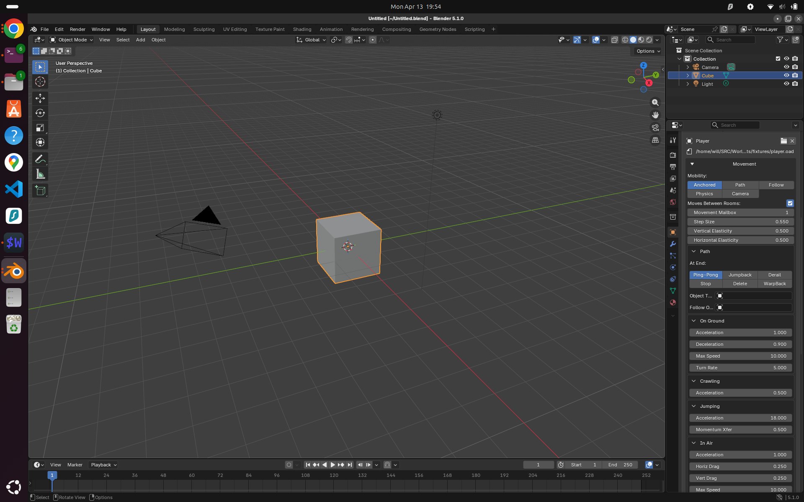
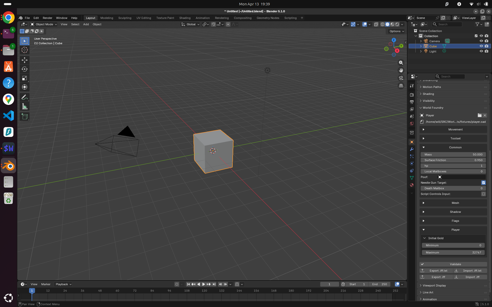
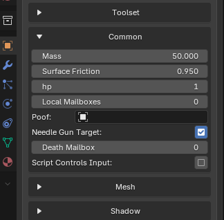
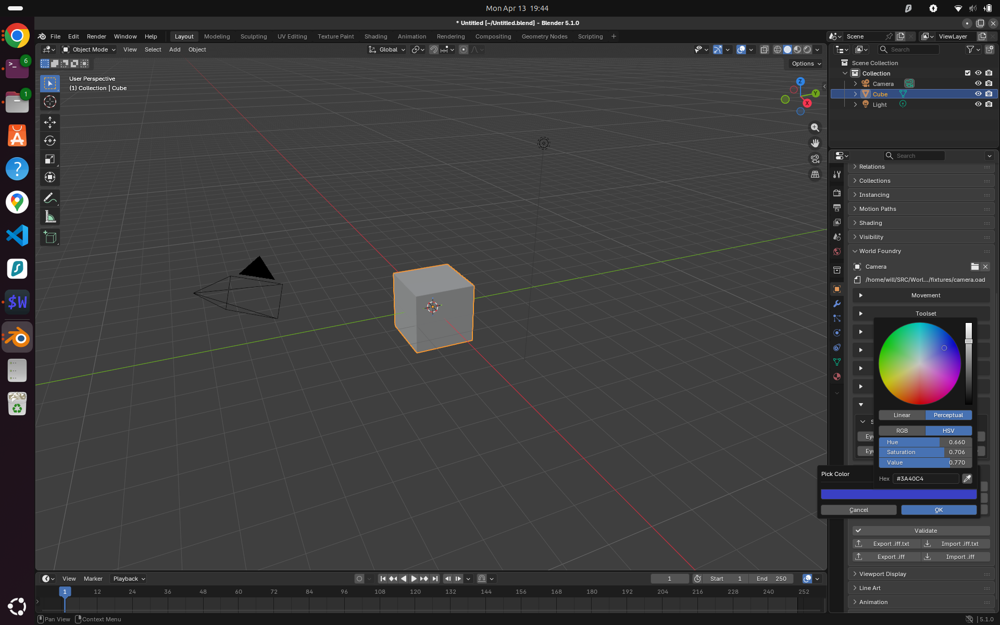
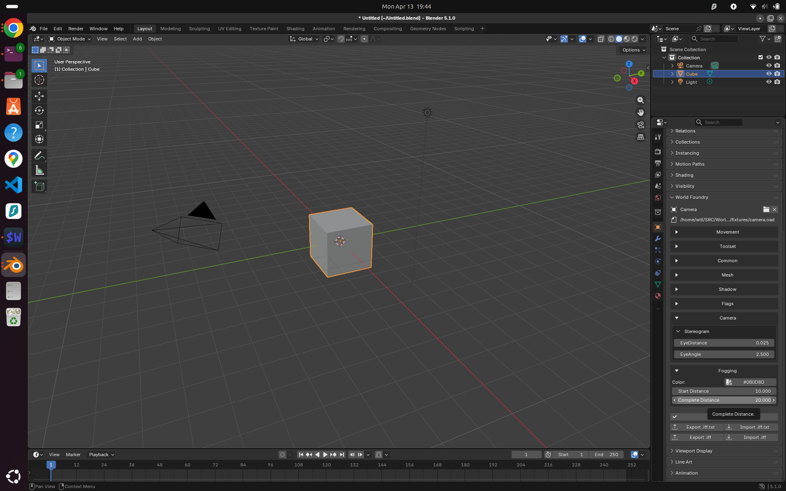

# Plan: ButtonType × showAs coverage audit and gap fixes

## Context

The Blender plugin renders OAD fields based on `FieldKind` (derived from `ButtonType` in
`classify()`) and `show_as` (the OAD `visualRepresentation` byte).  All OAS schema files
have been audited against the current plugin to find combinations that exist in real OAD
files but are not yet correctly handled.

---

## Coverage table

| ButtonType (value) | showAs (value) | FieldKind | Blender rendering | Status |
|---|---|---|---|---|
| Fixed16 / Fixed32 (0/1) | 0 N/A | Float | `layout.prop()` | ✅ |
| Fixed16 / Fixed32 (0/1) | 6 hidden | Float | hidden by `is_visible()` | ✅ |
| Int8/16/32 — no pipe items (2/3/4) | 0 N/A | Int | `layout.prop()` | ✅ |
| Int8/16/32 — no pipe items (2/3/4) | 1 number | Int | `layout.prop()` | ✅ |
| Int8/16/32 — no pipe items (2/3/4) | 2 slider | Int | `layout.prop()` + min/max → slider | ✅ |
| Int8/16/32 — no pipe items (2/3/4) | 7 color | Int | hex swatch + `wf.pick_color` dialog | ✅ |
| Int8/16/32 — no pipe items (2/3/4) | 8 checkbox | Bool | checkbox toggle | ✅ |
| Int8/16/32 + pipe items (2/3/4) | 3 toggle | Enum | button row (treated as radiobuttons) | ✅ |
| Int8/16/32 + pipe items (2/3/4) | 4 dropmenu | Enum | 2-col grid (5+ items) / button row (≤4) | ✅ |
| Int8/16/32 + pipe items (2/3/4) | 5 radiobuttons | Enum | button row | ✅ |
| Int8/16/32 + pipe items (2/3/4) | 8 checkbox | Enum | checkbox toggle (2-item enums) | ✅ |
| BUTTON_STRING (5) | 0 N/A | Str | `layout.prop()` | ✅ |
| ObjectRef / CamRef / LightRef / ClassRef (6/14/15/24) | 0 N/A | ObjRef | `prop_search()` | ✅ |
| BUTTON_OBJECT_REFERENCE (6) | 0x80 vector | ObjRef | `prop_search()` (flag is decorative) | ✅ |
| BUTTON_FILENAME (7) | 0 N/A | FileRef | text + file-browser button | ✅ |
| BUTTON_PROPERTY_SHEET (8) | 0 N/A | Section | collapsible box | ✅ |
| LEVELCONFLAG_* (9–13, 16, 22, 23, 27, 28) | 6 hidden | Bool | checkbox (exempted from hidden) | ✅ |
| BUTTON_MESHNAME (19) | 0 N/A | FileRef | text + file-browser button | ✅ |
| BUTTON_XDATA (20) | 0 N/A | Skip | hidden | ✅ (raw XData, no UI needed) |
| BUTTON_XDATA (20) | 11 texteditor | Str | `layout.prop()` | ✅ |
| BUTTON_GROUP_START (25) | 0 N/A | Group | non-collapsible box | ✅ |
| BUTTON_GROUP_STOP (26) | 0 N/A | GroupEnd | closes box | ✅ |

---

## showAs values

| Value | Symbol | Notes |
|---|---|---|
| 0 | `SHOW_AS_N_A` | Default; no UI hint |
| 1 | `SHOW_AS_NUMBER` | Numeric spinner |
| 2 | `SHOW_AS_SLIDER` | Slider widget |
| 3 | `SHOW_AS_TOGGLE` | Cycling toggle (rare; treated as radiobuttons) |
| 4 | `SHOW_AS_DROPMENU` | Drop-down menu |
| 5 | `SHOW_AS_RADIOBUTTONS` | Radio button group |
| 6 | `SHOW_AS_HIDDEN` | Hidden; Bool (levelcon flags) exempt |
| 7 | `SHOW_AS_COLOR` | Packed `0x00RRGGBB` integer |
| 8 | `SHOW_AS_CHECKBOX` | No-pipe-items → Bool; 2-item Enum → toggle |
| 9 | `SHOW_AS_MAILBOX` | Mailbox index (not observed in fixtures) |
| 10 | `SHOW_AS_COMBOBOX` | Editable dropdown (not observed in fixtures) |
| 11 | `SHOW_AS_TEXTEDITOR` | Multi-line text; used for Notes/Comments |
| 12 | `SHOW_AS_FILENAME` | File name entry; superseded by BUTTON_FILENAME |
| 0x80 | `SHOW_AS_VECTOR` | Bit flag; 3D vector component (camshot.oas) |

---

## Gap analysis

### Gap 1 — `TYPEENTRYBOOLEAN`: Int show_as=8 → checkbox  ✅ DONE

`classify()` now takes `show_as: u8`. `BUTTON_INT32` (no pipe items) + `show_as=8` maps
to `FieldKind::Bool`, rendering as a checkbox in Blender. No serialization changes needed
— `Bool` already writes a 4-byte LE int.

### Gap 2 — Enum show_as=4 (dropmenu): cramped button row  ✅ DONE

Enum fields with `show_as` 4/5 and 4+ items render as a balanced `grid_flow` grid with
max 3 items per row. Column count is `ceil(n / ceil(n/3))`, so:
- 4 items → (2,2); 5 → (3,2); 6 → (3,3); 7 → (3,3,1); 8 → (3,3,2); 9 → (3,3,3); etc.

Fields with ≤3 items keep the existing horizontal button row. Pure Python change in
`panels.py`.

### Gap 3 — BUTTON_XDATA annotation fields  ✅ DONE

`BUTTON_XDATA` + `conversionAction=XDATA_IGNORE` (0) maps to `FieldKind::Annotation`.
All such fields appear as text boxes in Blender, flow through `to_iff_txt` / `from_iff_txt`
like any string field, and produce zero bytes in the binary `.iff` output. Fields with any
other conversionAction remain `FieldKind::Skip`.

### Gap 4 — Int show_as=7 (color): 3 fields  ✅ DONE

`FoggingColor`, `Background Color` (camera.oad / mesh.inc) are 24-bit packed RGB integers
(`0x00RRGGBB`, range 0..0xFFFFFF).

Storage stays as a plain integer ID property.  The panel renders a `#RRGGBB` hex label
and a `wf.pick_color` button.  Clicking opens an `invoke_props_dialog` with a native
Blender `FloatVectorProperty(subtype='COLOR')` picker; on confirm the RGB floats are
packed back to an int and written to the property.

---

## Critical files

| File | Change |
|------|--------|
| `wftools/wf_attr_schema/src/lib.rs` | Add `show_as: u8` param to `classify()`; map Int+show_as=8→Bool; map XData+show_as=11→Str |
| `wftools/wf_blender/panels.py` | Enum dropmenu: 2-col grid for 5+ items; Int show_as=7: hex swatch + pick_color button |
| `wftools/wf_blender/operators.py` | Add `WF_OT_pick_color`: invoke_props_dialog with FloatVectorProperty(subtype='COLOR') |

No changes needed to `wf_py`, `wf_attr_serialize`, or `wf_attr_validate`.

---

## Verification

### 1. Rust tests

16 tests passing (`cargo test` in `wf_attr_schema/`).

### 2. Gap 2 — Enum dropmenu grid (player.oad)

Movement section → "At End Of Path" (5 items, show_as=4): renders as balanced grid
(3,2) with max 3 per row. ✅

Overview with Movement section expanded:

### 3. Gap 1 — TYPEENTRYBOOLEAN checkbox

`common.inc` (included in all schemas) has two bare `TYPEENTRYBOOLEAN` fields:
"Needle Gun Target" and "Script Controls Input". Both render as checkboxes. ✅

### 4. Gap 3 — Notes field (Str from BUTTON_XDATA)

`BUTTON_XDATA` + `show_as=11` now maps to `FieldKind::Str` in `classify()`, surfacing
the Notes/Comments annotation field as a plain text box. All other XData variants
(show_as=0) remain `Skip`. ✅

### 5. Gap 4 — Color picker

`camera.oad` attached → Fogging section → "Color" field renders as `#RRGGBB` hex button;
clicking opens the Blender color wheel dialog. ✅

Color field hex button and picker dialog open:

Panel with color hex button rendered in Fogging section:

